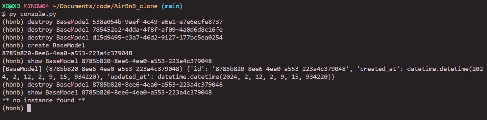

# AirBnB_clone
Alx AirBnB Team Project

## Project File Structure
```bash
.
├── AUTHORS
├── README.md
├── console.py
├── models
│   ├── __init__.py
│   ├── amenity.py
│   ├── base_model.py
│   ├── city.py
│   ├── engine
│   │   ├── __init__.py
│   │   └── file_storage.py
│   ├── place.py
│   ├── review.py
│   ├── state.py
│   └── user.py
├── tes1.py
├── tes3.py
├── test.py
└── tests
    ├── test_amenity.py
    ├── test_base_model.py
    ├── test_city.py
    ├── test_engine
    │   ├── __init__.py
    │   └── test_file_storage.py
    ├── test_place.py
    ├── test_review.py
    ├── test_state.py
    └── test_user.py

4 directories, 25 files
```

## 0. README, AUTHORS
- [x] Write README.md
- [x] Write AUTHORS

## 1. Be pycodestyle compliant!
- pass pycodestyle checks

## 2. Unittests
- write tests FOR everything

## 3. BaseModel
- write BaseModel

## 4. Create BaseModel from dictionary
- From Dict/json to BaseModel init
## 5. Store first object
- File storing Class
- Dict to json
- Json to dict
## 6. Console 0.0.1
- basic console setup
## 7. Console 0.1
- add all
- add show
- add create
- add destroy
- add Update
### Sample

## 8. First User
- Inherit from basemodel
## 9. More classes!
- alot of classessss!
- Inherited from basemodel
## 10. Console 1.0
- add support for new classses
